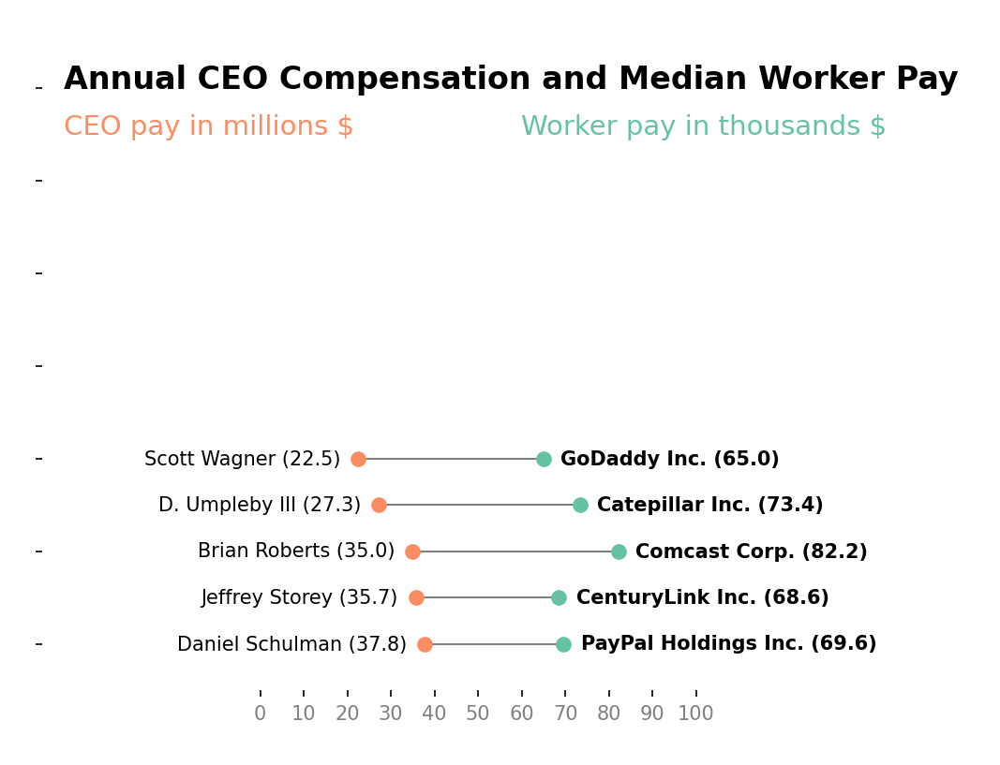
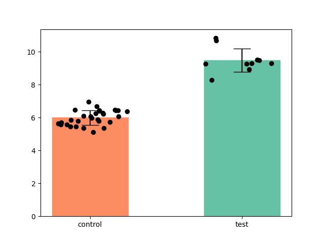
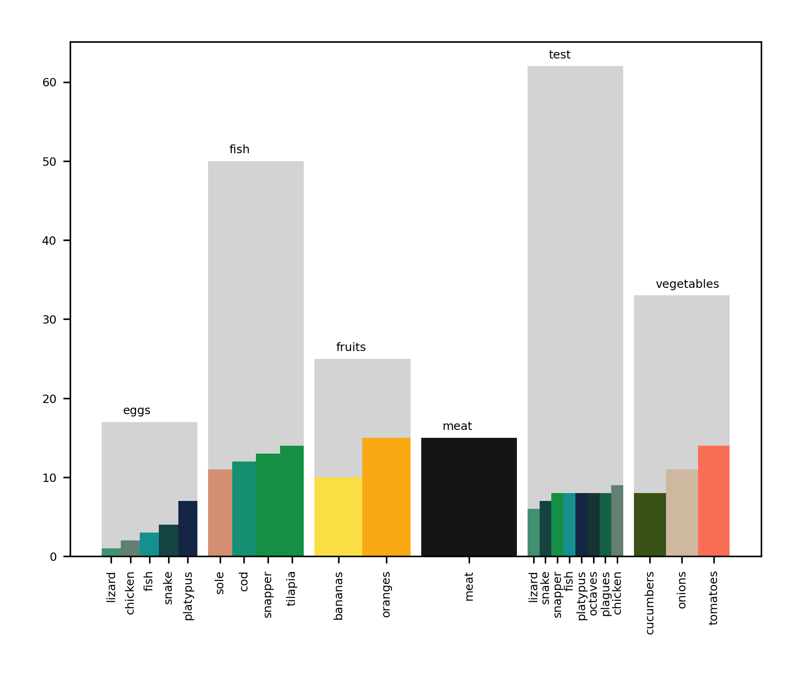
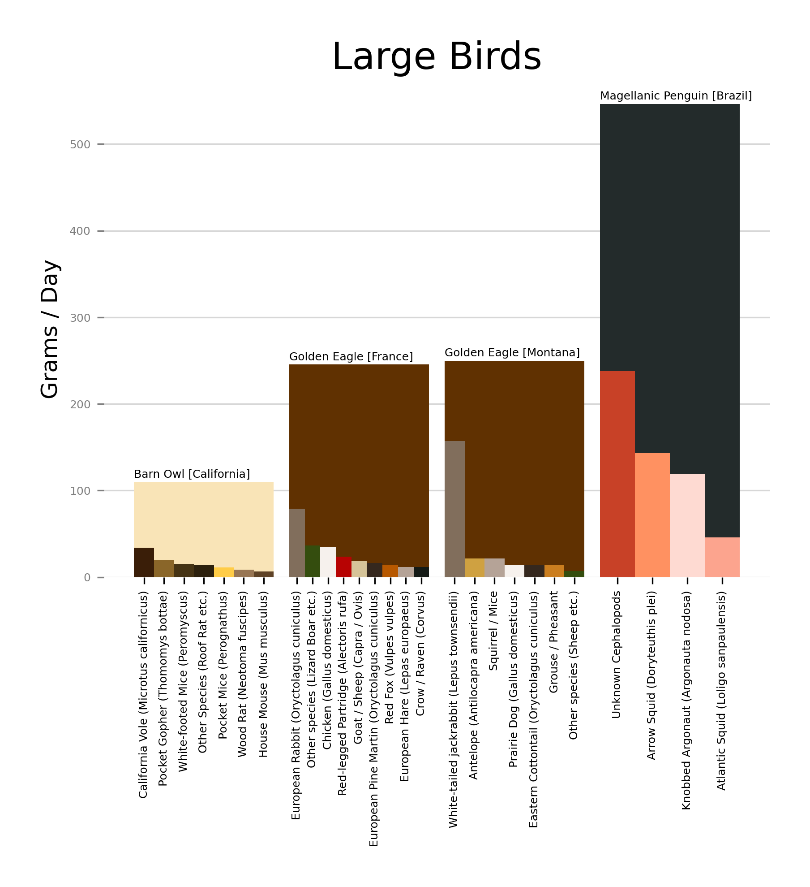

# gallimaufry

Assortment of useful (to me anyway) scripts and commands


## generate_primitive_gif.py

Relies on [Primitive](https://github.com/fogleman/primitive), used to make "images come to life".

### Prerequisites

- [Primitive](https://github.com/fogleman/primitive)
- [Imagemagick](https://imagemagick.org/index.php)

### Usage

```bash
# mode: 0=combo, 1=triangle, 2=rect, 3=ellipse, 4=circle, 5=rotatedrect, 6=beziers, 7=rotatedellipse, 8=polygon
python3 generate_primitive_gif.py [-i image_path] [-o outout_path] [-n number_of_shapes] [-m mode]
```

```bash
python3 generate_primitive_gif.py 5000,5000,5000,5000 data/Night_Parliament.jpg output/Parliament.gif
```

For a single image just use primitive directly:

```bash
primitive -i input_file -o output_file -n number_of_shapes -m mode
```

### Animation

"Focusing" GIF:


[Creative Commons License](https://creativecommons.org/licenses/by/2.0/deed.en) </br>
4 April 2017, 15:33 </br>
[Painted Redstart](https://commons.wikimedia.org/wiki/File:Painted_Redstart_(33899681692).jpg) </br>
Andy Reago & Chrissy McClarren </br>
Modified with primitive, by Rincon Rex </br>

"Shimmering" GIF:


### Acknowledgments

[Fogleman](https://github.com/fogleman/) made primitive.


## colorer.py

Basic image manipulations (joining, bordering, etc.) in Python3.

### Prerequisites

Relies on:
- [Pillow](https://pillow.readthedocs.io)
- [Pypng](https://pypi.org/project/pypng/)
- [Numpy](https://numpy.org/)

### Usage

```bash
# mode: v = vertical gradient, h = horizontal gradient, ch = concatenate horizontally, cv = concatenate vertically, s = solid color, r = rainbow gradient, ub = uniform border, b = custom image with dimensions as centered background
# two colors only needed for gradient modes v and h, input images only needed for concatenation modes ch and cv
# solid color image needs one color obviously
python3 colorer.py [--mode] [-i first_input_image] [-e second_input_image] [-o output_image] [--height] [--width] [-c first_color] [-k second_color]
```

Solid color image:

```bash
python3 colorer.py --mode s -c 64,255,183 -o sample.png --height 1200 --width 300
```


Vertical gradient image:

```bash
python3 colorer.py --mode v -c 255,211,0 -k 255,0,107 --height 400 --width 300 -o output/gradient.png
```


Concatenate images horizontally:

```bash
python3 colorer.py --mode ch -i output/gradient.png -e output/light_teal.png -o output/concatenated.png --height 400 --width 300
```


Make a solid color border:

```bash
python3 colorer.py --mode ub -i output/gradient.png -b 30 -c 64,255,183 -o output_border.png
```


## consumer_reports_plot.py

Small plotter dependent on matplotlib, uses numpy, but can easily be modified. Dataframes will also be available next update. 1 row heatmaps are not super useful, but it's there when needed.

- [Matplotlib](https://matplotlib.org/)
- [Numpy](https://numpy.org/)

### Usage

```python

from consumer_reports_plot import cr_plot
# cr_plot(data, row_labels, column_labels, output_path, default_val=0, width=15, colormap=None, graph_aspect=0.15)

cars = ['Toyota Corrola', 'Toyota Camry', 'Toyota Prius']
years = [2015, 2016, 2017, 2018, 2019, 2020]
samps = np.array([[0, 0, 0, 5000, 7000, 10000],
                [0, 0, 5000, 7000, 9000, 12000],
                [7000, 9000, 11000, 13000, 15000, 16000]]
        )
cr_plot(samps, cars, years, 'car_tester.png', colormap='viridis', title='Used \ car \ price')
```

### Plot:


## pair_dot_plot.py

Takes dataframe of magnitude normalized numeric data. © 2018 Aaron Penne is the original author.

[Original code](https://github.com/aaronpenne/data_visualization#annual-company-revenue-vs-annual-ceo-compensation)

### Usage

Data Sources: </br>
[Highest Paid CEOs](https://aflcio.org/paywatch/highest-paid-ceos) </br>
[Company Worker-to-pay-ratios](https://aflcio.org/paywatch/company-pay-ratios) </br>

```python

import pair_dot_plot as dot
import pandas as pd
'''
data.csv:
Median Worker Salary,CEO Salary,Entity,CEO
82.2,35.0,Comcast Corp.,Brian Roberts
73.4,27.3,Catepillar Inc.,D. James Umpleby III
69.6,37.8,PayPal Holdings Inc.,Daniel Schulman
43.7,21.4,Hilton Worldwide,Christopher Nassetta
22.5,22.1,Walmart Inc.,C. McMillon
42.7,43.3,Kraft Heinz Company,Miguel Patricio
11.1,12.4,Gamestop Corp.,George Sherman
1.8,4.6,Universal Corp.,George Freeman III
2.0,8.4,A&F Co. (ANF),Fran Horowitz
5.5,15.5, Mattel Inc.,Ynon Kreiz
'''

df = pd.read_csv('/home/username/data.csv', header=None)
output_dir = dot.make_output_dir('/home/username/data_dir')
fig = dot.dot_pair_plot(df,
  'Annual CEO Compensation and Median Worker Pay',
  'Total CEO pay in millions $',
  'Median Worker pay in thousands $',
  colors=['#AFF8DB', '#FF9CEE', '#FDCF76']
)
dot.save_figure(fig, output_dir, 'test.png')
```

### Plot:


## bar_and_datapoints_plot.py

Bar plot with data points overlayed.

[Original source](https://stackoverflow.com/questions/51027717/pyplot-bar-charts-with-individual-data-points/51032760)

Depends on:
- [Pandas](https://pandas.pydata.org/)
- [Matplotlib](https://matplotlib.org/)

### Usage

```python

import bar_and_datapoints_plot as bdp
bar_width = 0.5
bar_coordinates = [1, 2]
colors = ['#FC8D62','#65C2A5']
data = [np.random.random(30) * 2 + 5, np.random.random(10) * 3 + 8]
bdp.bar_and_data_plot(
  bar_coordinates,
  data,
  'bar_points.png',
  tick_labels=tick_labels,
  bar_width=bar_width,
  bar_colors=colors
)
```

### Plot:



## ding_an_sich_plot.py

Nested bar graph.

Depends on:
- [Pandas](https://pandas.pydata.org/)
- [Matplotlib](https://matplotlib.org/)

### Usage

```python
import ding_an_sich_plot as das

data = [
    ['bananas', 'fruits', 10, '#FFE135'],
    ['oranges', 'fruits', 15, '#FFA500'],
    ['tomatoes', 'vegetables', 14, '#FF6347'],
    ['onions', 'vegetables', 11, '#CFB59B'],
    ['cucumbers', 'vegetables', 8, '#284400'],
    ['meat', 'meat', 15, '#000000'],
    ['cod', 'fish', 12, '#008866'],
    ['sole', 'fish', 11, '#D38866'],
    ['tilapia', 'fish', 14, '#008833'],
    ['snapper', 'fish', 13, '#008833'],
    ['chicken', 'eggs', 2, '#557766'],
    ['lizard', 'eggs', 1, '#338866'],
    ['snake', 'eggs', 4, '#003233'],
    ['fish', 'eggs', 3, '#008888'],
    ['platypus', 'eggs', 7, '#001234'],
    ['snapper', 'test', 8, '#008833'],
    ['chicken', 'test', 9, '#557766'],
    ['lizard', 'test', 6, '#338866'],
    ['snake', 'test', 7, '#003233'],
    ['fish', 'test', 8, '#008888'],
    ['platypus', 'test', 8, '#001234'],
    ['octaves', 'test', 8, '#002222'],
    ['plagues', 'test', 8, '#005234']
]

df = pd.DataFrame(data, columns = ['Label', 'Category', 'Amount', 'Color'])
plotted = das.ding_an_sich_plot(df)
das.save_figure(p, '/home/username/output_dir', 'nested.png')
```

### Plot:



### Examples:


