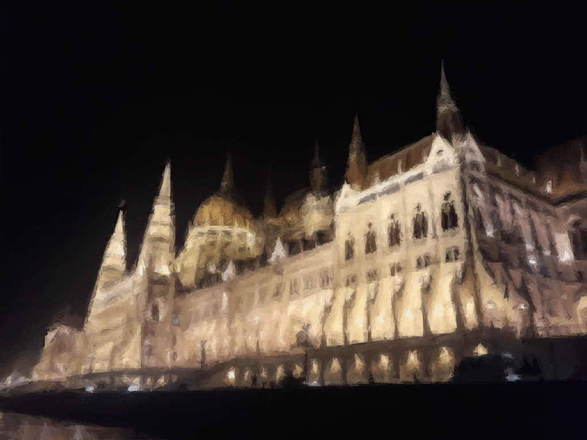

# gallimaufry

Assortment of useful (to me anyway) scripts and commands


## generate_primitive_gif.py

Relies on [Primitive](https://github.com/fogleman/primitive), used to make "images come to life".

### Prerequisites

- [Primitive](https://github.com/fogleman/primitive)
- [Imagemagick](https://imagemagick.org/index.php)

### Usage

```bash
# mode: 0=combo, 1=triangle, 2=rect, 3=ellipse, 4=circle, 5=rotatedrect, 6=beziers, 7=rotatedellipse, 8=polygon
python3 generate_primitive_gif.py [-i image_path] [-o outout_path] [-n number_of_shapes] [-m mode]
```

```bash
python3 generate_primitive_gif.py 5000,5000,5000,5000 data/Night_Parliament.jpg output/Parliament.gif
```

For a single image just use primitive directly:

```bash
primitive -i input_file -o output_file -n number_of_shapes -m mode
```

### Animation

"Focusing" GIF:


[Creative Commons License](https://creativecommons.org/licenses/by/2.0/deed.en)
4 April 2017, 15:33
[Painted Redstart](https://commons.wikimedia.org/wiki/File:Painted_Redstart_(33899681692).jpg)
Andy Reago & Chrissy McClarren
Modified with primitive, by Rincon Rex

"Shimmering" GIF:



### Acknowledgments

[Fogleman](https://github.com/fogleman/) made primitive.


## colorer.py

Relies on [Pillow](https://github.com/fogleman/primitive)

### Prerequisites

- [Pillow](https://github.com/fogleman/primitive)
- PNG python3 package

### Usage

```bash
# mode: 0=combo, 1=triangle, 2=rect, 3=ellipse, 4=circle, 5=rotatedrect, 6=beziers, 7=rotatedellipse, 8=polygon
python3 colorer.py [-i image_path] [-o outout_path] [-n number_of_shapes] [-m mode]
```

Solid color image:

```bash
python3 colorer.py --mode s -c 64,255,183 -o sample.png --height 1200 --width 300
```

Vertical gradient image:

```bash
python3 colorer.py --mode v -c 255,211,0 -k 255,0,107 --height 400 --width 300 -o output/yellow_pink.png
```


Concatenate images horizontally:

```bash
python3 colorer.py --mode ch -i con.png -e con.png -o con2.png --height 1200 --width 300
```
